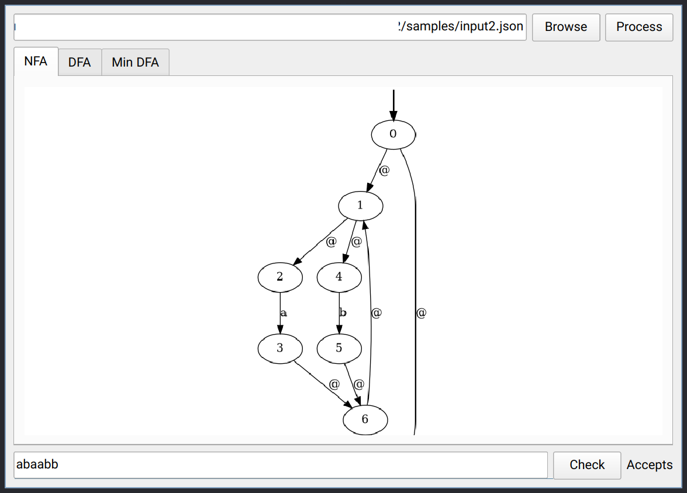
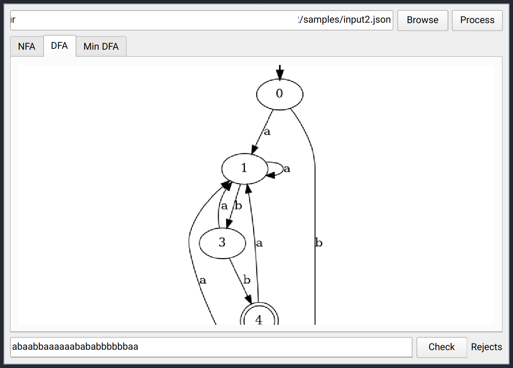

# AutomaPY
> GUI and CLI tool for converting NFA to DFA and minizing the DFA


## Table of Contents
- [Instructions](#Introduction)
- [Usage Guide](#Usage-guide)
- [Screenshots](#Screenshots)
- [See Also](#see-also)

## Introduction
This tool takes a NFA in a JSON format as input and draws the graphs of its corresponding DFA and minimized DFA. It can also provide the JSON representation of the DFA as output.

The CLI tool provides various options for tuning the behaviour of the tool.

The GUI front-end is a wrapper around the CLI tool that uses Pyside6 as its toolkit and graphviz to draw the automaton. You can also test strings for acceptance or rejection by the automaton.

The JSON format that is used to represent an automaton is as follows: ( '@' is used to denote to the epsilon transition)
``` json
{
    "states": [0, 1, 2, 3, 4, 5, 6, 7, 8, 9, 10],
    "alphabet": ["a", "b"],
    "transitions": [
        [0, "@", [1, 7]],
        [1, "@", [2, 4]],
        [2, "a", [3]],
        [3, "@", [6]],
        [4, "b", [5]],

        [5, "@", [6]],
        [6, "@", [7, 1]],
        [7, "a", [8]],
        [8, "b", [9]],
        [9, "b", [10]]
    ],
    "initial": 0,
    "final": [10]
}

```
## Usage Guide
The CLI provides the following options:
```
    Provide the output path: -o /out/path
    Disable print to stdout: -s
    Read from stdin: -i
    Render graph to output file path: -r
    Minimize the DFA: -m
```
The GUI is pretty straight forward and requires no further explanation.

## Screenshots



## See Also
[DFA](https://en.wikipedia.org/wiki/Deterministic_finite_automaton)
[NFA](https://en.wikipedia.org/wiki/Nondeterministic_finite_automaton)
[PySide](https://wiki.qt.io/Qt_for_Python)
